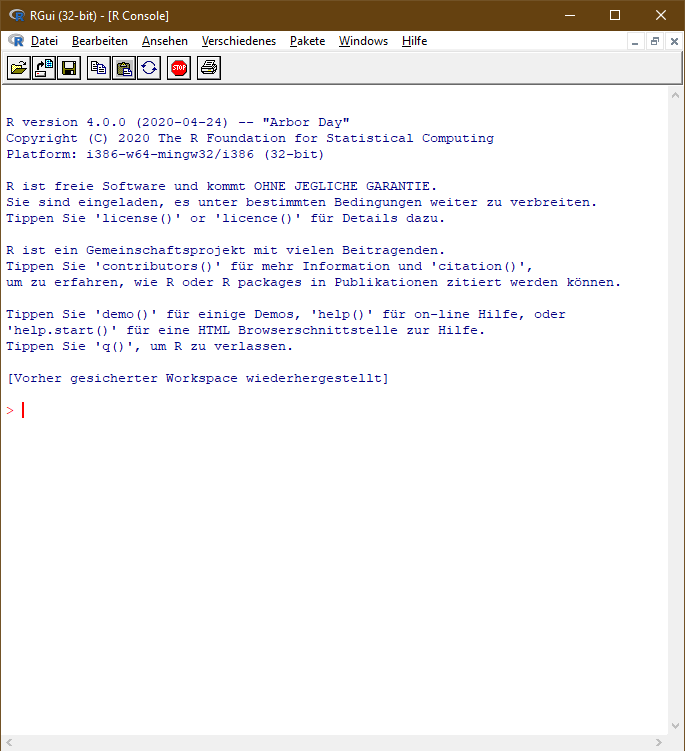

# Exercise 2: Getting R ready

**In General**: Please ask questions in the [ilias-Forum](https://www.ilias.uni-koeln.de/ilias/goto_uk_frm_3270419.html) for this course, so that others can also see the question and answer*.

*Please submit your solutions to this exercise until May 8th.*

The goal of this exercise is to get the R environment on your computer ready and to get a first grasp on basic concepts of R. After installation, we will follow [this tutorial](https://cran.r-project.org/doc/manuals/r-release/R-intro.html), which is also available as a [PDF](https://cran.r-project.org/doc/manuals/r-release/R-intro.pdf) or [epub](https://cran.r-project.org/doc/manuals/r-release/R-intro.epub) file. It is the official R introduction produced by the developers of R.

As a head's up: We will be doing exercises with "base R" for the next few exercises, but will switch to using the R development environment RStudio later (this will be in a separate exercise). For the first exercises, RStudio doesn't help you much.

## Step 1
Install and launch R for the first time. Please go to [this page](https://cran.r-project.org/index.html) and install R for your operating system. 

After successful installation and launch of the R graphical user interface, it should look roughly like one of these:

  

This is the R interpreter. It prompts you to enter commands after the `>` character. In this way, you can use R interactively (similar to the python interpreter, if you're familiar with that -- if not, don't worry, no need to be). 

## Step 2
Read the tutorial!

Please now skim over the [chapter 1](https://cran.r-project.org/doc/manuals/r-release/R-intro.html#Introduction-and-preliminaries) of the tutorial, and then work over [chapter 2](https://cran.r-project.org/doc/manuals/r-release/R-intro.html#Simple-manipulations-numbers-and-vectors).

Chapter 1 gives some background information that you don't *really* need to know. Skim over the headings and read if you find things interesting.

Chapter 2 introduces the first basic concepts of R. It's a good thing to play with the examples, and see what's happening. It's really hard to break anything, so don't be afraid to try things.

## Step 3
This step is to get ready to do exercises.
Go into the directory in which you want to do the exercises. This is a repetition of the steps in the last exercise. 

In the examples, I'll use "Textanalyse-mit-R", you should replace this with the path to your directory: `cd Textanalyse-mit-R`

Clone this repository: `git clone https://github.com/idh-cologne-sprachverarbeitung-mit-r/exercise-02.git`

Enter the directory `cd exercise-02` (this step was missing last time, sorry about that).

Create a new branch for you: `git checkout -b USERNAME`.

## Step 4
Again (as last week), open the file `R/exercise.R` in your favorite text editor. Depending on your operating system and settings, double clicking may open an editor that came with the R installation. All the commands that you have played with in step 2 can also be written in files. This is what we will do now. To make it clear what is expected of you, the first task is already solved in the file `R/exercise.R`

- a) Please create a variable called `a` that contains the number 5.
- b) Please create a variable called `b` that contains the character sequence `Hello`.
- c) Please create a variable called `c` that contains a vector with 5 elements (of your choice).
- d) Please create a variable called `d` that contains the numbers from 1 to 1000.
- e) Create a variable `e` that contains logical values (i.e., true or false). The values should reflect whether the same position in vector `d` is even. I.e., every second position should contain `TRUE`.
- f) Create a variable `f` that adds contains *only* the even numbers between 1 and 1000.
- g) Assign the length of vector `f` to a variable `g`.
- h) Assign the mean of vector `f` to a variable `h`.
- i) The file `R/exercise.R` contains a variable assignment `i0`. Find a way to define a variable `i`, such that it contains the elements of `i0` *in reverse order*.

## Step 5
Your file `R/exercise.R` should now contain a number of lines with assignment statements (using `=`, `<-`, or `->`). Don't forget to save your file.
Now turning back to git: Add your file to the staging area (`git add R/exercise.R`), commit it (`git commit -m ""`, you need to fill in a commit message), and push it to the server (`git push --set-upstream origin BRANCHNAME`).

## Step 6

Wait a few minutes. Then go to https://github.com/idh-cologne-sprachverarbeitung-mit-r/exercise-02/actions, select your branch and watch for the results. If your commit has a green checkmark, you're good to go. If you see a red cross, there is a mistake in your code. In this case, you can click on the commit message and inspect the details of the mistake. After that, you should go back to step 4, fix the bug, and add/commit/push again.